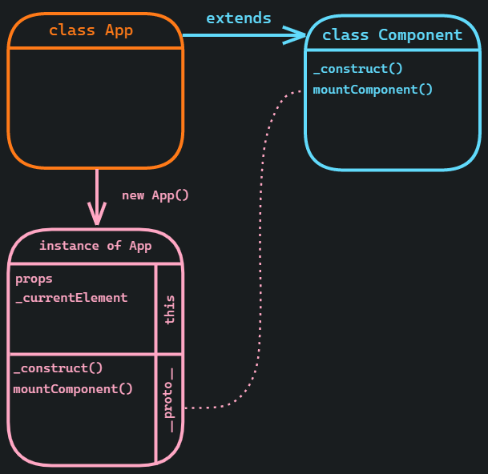
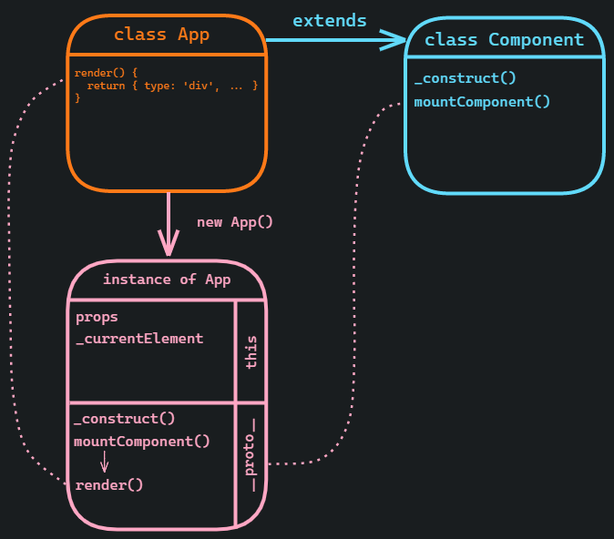
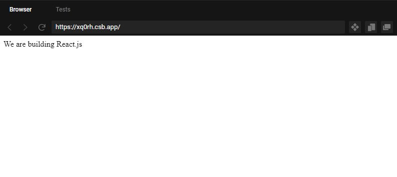
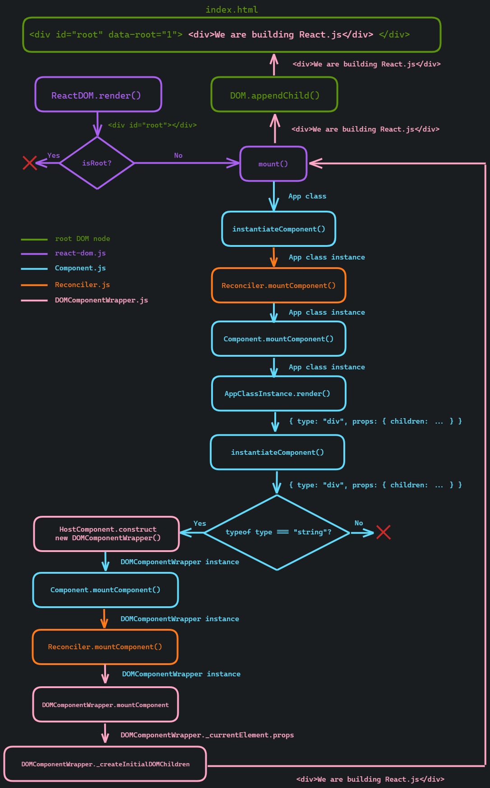

## Introduction

This is a second part of *Build your own React.js series*. Click [here](/build-your-own-react-render) if you didn't read the first part.

## Implementing Component

In the previous article, we stopped at creating our first `App` class and passing it to `render` (`ReactDOM.render` in React.js) function. We figured out that in order to continue we need to implement `Component` class (`React.Component` in React.js) and extend `App` class from it.

From `instantiateComponent` function, we know that when we create an instance of the `App` class we pass `element.props` to its constructor and then call `_construct` method.

```js
  // Component.js

  function instantiateComponent(element) {
    const wrapperInstance = new element.type(element.props);
    wrapperInstance._construct(element);

    return wrapperInstance;
  }
```

This means that `Component` class should be able to handle `element.props` in its constructor and should have the `_construct` method so that `App` class could inherit them.

Turns out this part is pretty simple. We get `element.props` in the constructor and assign them to `this.props` so that our instance of the `App` class could have access to its props.

```js
  // Component.js

  class Component {
    constructor(props) {
      this.props = props;
      this._currentElement = null;
    }

    _construct(element) {
      this._currentElement = element;
    }
  }
```
In the `_construct` method, we assign `{ type: App }` element, to the `_currentElement`. We will discuss why we do it a little bit later.

>Remember that only class instances can have `this`. It's an oversimplification but when you create, let's say an App class by declaring `class App`, you create a blueprint of the instance of that App class and it doesn't have `this`. But when you call `new App()` (we do it in `instantiateComponent`) you create an instance of the App class that has it's own `this`. In the `Component` class by saying `this.props` or `this._currentElement` we are referring to the `props` and `_currentElement` of the instance of whatever class that will extend `Component` class. Again, it's a very simplified explanation but hopefully, it will help you understand the logic behind this.

For now, let's return to the place where we created the `App` class and passed it to `render`. Since now we have `Component` class let's extend `App` class from it.

```js
  // index.js

  class App extends Component {}

  ReactDOM.render(
    { type: App, props: { title: "React.js" } },
    document.getElementById("root")
  );
```

>From now we can call our `App` class not just a class but a `class component`.

As you can see I also added `props` field to the `element` object to check if `Component` class constructor works. To see results, we need to go back to the `mount` function and `console.log` the result of the `instantiateComponent` function call.

```js
  // react-dom.js

  function mount(element, node) {
    node.dataset[ROOT_KEY] = rootID;
    const component = instantiateComponent(element);
    console.log(component);
  }

  App: {
    props: {
      title: "React.js"
    },
    _currentElement: {
      type: App,
      props: {
        title: "React.js"
      }
    }
  }
```


>On this scheme, App class component instance has its own `props` and `_currentElement` fields (`this` section) and get `mountComponent` and `_construct` methods from `Component` class using prototype chain (`__proto__` section). If you want to know more about prototype chain, I would recommend to look at this video: <a href="https://www.youtube.com/watch?a&v=PMfcsYzj-9M" target="_blank" rel="noopener">The Definitive Guide to Object-Oriented JavaScript</a>.

Nice! We've got an instance of our `App` class component with the fields that we expected.

Try to look at the dev console yourself <a href="https://codesandbox.io/s/building-your-own-reactjs-reactcomponent-xq0rh?file=/src/react-dom.js:473-502" target="_blank" rel="noopener">using this Codesandbox example</a> (marked as `App instance` in dev console).

Now let's continue implementing the `mount` function.
```js
  // react-dom.js

  let instancesByRootID = {};
  let rootID = 1;

  function mount(element, node) {
    node.dataset[ROOT_KEY] = rootID;
    const component = instantiateComponent(element);

    instancesByRootID[rootID] = component;
    const renderedNode = Reconciler.mountComponent(component, node);
  }
```
We add the newly created instance of the `App` class component to the `instancesByRootID` object by `rootID`. We will need `instancesByRootID` object later when we will perform the `update` and `unmount`.

Next, we call `mountComponent` of the `Reconciler`. This is where the fun begins.

```js
  // Reconciler.js

  function mountComponent(component) {
    return component.mountComponent();
  }
```

As you can see, `mountComponent` just calls `mountComponent` of the instance of the `App` class component itself. Since `App` class component extends `Component` class, we need to add `mountComponent` method to `Component` class.

```js
  // Component.js

  class Component {
    ...
    mountComponent() {
      const renderedElement = this.render();
      ...
    }
  }
```

In the `mountComponent` we start with calling `this.render` function. You may think that it's the function that we've implemented at the beginning, i.e. `ReactDOM.render` but it's not. Remember how in the real React.js library we usually create a class component with `render` method and return `jsx` from it? That's the method that we call here. Except that we will use objects instead of jsx.



Notice how we declared `render` in `App` class component unlike previously we declared, for example, `mountComponent` in `Component` class. That's because `mountComponent` is an internal mechanism which is controlled by React.js library itself. `render` method in the `App` class component, on the other side, is controlled by developers, by you. You may say "How about `props`? Props are controlled by developers, but the assignment of props happens in the `Component` class". That's true, but we actually just say to React.js library "Hey! I need to pass these props to this class component" and React.js creates an instance of this class component with the props that you passed. In the real React.js application we never assign props inside of the constructor of the class component, right? 

Do you remember what we usually assign in the constructor when we create a class component?

That's right! We assign `state`. So React.js kind of says to developer "Put the data that periodically changes in the `state` and put some jsx into `render` when you create a class component. And I will do the rest". That's really important to understand to go further.

Now we need to go to the `App` class component and create `render` method that returns `div` element with the text `We are building ${this.props.title}` as a child.

```jsx
  // index.js

  class App extends Component {
    render() {
      return {
        type: "div",
        props: { children: `We are building ${this.props.title}` }
      };
    }
  }

  // is the same as
  class App extends Component {
    render() {
      return <div>{`We are building ${this.props.title}`}</div>
    }
  }

```

Let's look at the results of calling `this.render` in the `Component` class implementation.

```js
  // Component.js

  mountComponent() {
    const renderedElement = this.render();
    console.log(renderedElement);
    // { type: "div", props: { children: `We are building ${this.props.title}` } }
    const renderedComponent = instantiateComponent(renderedElement);
  }
```
We've got what we declared in the `render` method of the App class component. Nice!

Next, we call `instantiateComponent` with this result. The current implementation of `instantiateComponent` expects `element.type` to be a class component. So we need to add support for DOM elements in the `element.type`, i.e. `div`, `a`. Pay attention that we use string ("div") to describe a DOM element and not actual HTML tag (div). 

```js
  // Component.js

  // before
  function instantiateComponent(element) {
    const wrapperInstance = new element.type(element.props);
    wrapperInstance._construct(element);

    return wrapperInstance;
  }

  // after
  function instantiateComponent(element) {
    let wrapperInstance;
    if (typeof element.type === 'string') {
      wrapperInstance = HostComponent.construct(element);
    } else {
      wrapperInstance = new element.type(element.props);
      wrapperInstance._construct(element);
    }

    return wrapperInstance;
  }
```

We added the condition that checks if the type of `element.type` is a `string` (e.g. "div") and if it's true, we call `HostComponent.construct` which is very simple. I think the real React.js does some more work here and it was left in such a way just to preserve the structure.

```js
  // HostComponent.js

  function construct(element) {
    return new DOMComponentWrapper(element);
  }
```

`DOMComponentWrapper`, as you can see from the name, is a class wrapper around DOM elements (such as "div"). This wrapper is necessary for storing the state (don't confuse with the class component state) of the element. Also, it creates homogeneity between handling class components and DOM elements because it's quite similar to `Component` implementation.

```js
  // DOMComponentWrapper.js

  class DOMComponentWrapper {
    constructor(element) {
      //element == {type: "div", props: {children: We are building ${this.props.title}}}
      this._currentElement = element;
    }
  }
```

For now, we just get an element in the constructor and assign it to the `_currentElement`.

Now we need to return to the `mountComponent` of the the `Component` class. We get `DOMComponentWrapper` from `instantiateComponent` and pass it to `Reconciler.mountComponent`. Remember we used it in `mount` function in the beginning? The difference is that we used it to mount `App` class component and now we use it to mount the content of `render` method of an `App` class instance.

```js
  // Component.js

  class Component {
    constructor(props) {
      this.props = props;
      this._currentElement = null;
      this._renderedComponent = null;
    }
    ...
    mountComponent() {
      const renderedElement = this.render();
      const renderedComponent = instantiateComponent(renderedElement);
      console.log(renderedComponent) // DOMComponentWrapper

      this._renderedComponent = renderedComponent; // needed for update 
      return Reconciler.mountComponent(renderedComponent);
    }
  }
```

Don't feel frustrated if you don't understand some parts - it will make sense after several passes as it was in my case. Also, there will be a flowchart at the end of the article that will, hopefully, help you to build a mental model of the process.

In `Reconciler` we call mountComponent of the `DOMComponentWrapper`.


```js
  // Reconciler.js

  function mountComponent(component) { // DOMComponentWrapper
    return component.mountComponent();
  }
```

Let's implement it.

 ```js
  // DOMComponentWrapper.js

  class DOMComponentWrapper {
    constructor(element) {
      this._currentElement = element;
      this._domNode = null;
    }

    mountComponent() {
      let el = document.createElement(this._currentElement.type);
      this._domNode = el;
      this._createInitialDOMChildren(this._currentElement.props);
      return el;
    }
  }
```

We take element from `_currentElement` that we assigned when we created `DOMComponentWrapper` and use it to create a `div` DOM element by calling `document.createElement('div')`. Exciting!

`_domNode` will hold the newly created DOM element. 

Now time to create children of this `div` element. For it, we need to implement `_createInitialDOMChildren`.

 ```js
  // DOMComponentWrapper.js

  class DOMComponentWrapper {
    constructor(element) {
      this._currentElement = element;
      this._domNode = null; // <div></div>
    }
    ...
    _createInitialDOMChildren(props) {
      // element === { children: `We are building ${this.props.title}` }
      if (typeof props.children === "string") {
        this._domNode.textContent = props.children;
      }
    }
  }
```

 >We assume for now, that `children` prop of the element can only be of `string` type. 
 
In `_createInitialDOMChildren` we get DOM node from `_domNode` and assign `children` prop, which is string, to its `textContent` attribute. Now we have
```jsx
  <div>We are building React.js</div>
```
DOM element.

We are very close to rendering our `App` class component to the screen.

Let's return to the `mount` function and add final steps.

```js
  // react-dom.js

  function mount(element, node) {
    node.dataset[ROOT_KEY] = rootID;
    const component = instantiateComponent(element);
    instancesByRootID[rootID] = component;
    const renderedNode = Reconciler.mountComponent(component, node);
    console.log(renderedNode) // <div>We are building React.js</div>
  }
```

We know that `Reconciler.mountComponent(component, node)` returns a DOM element. We need to append it to the root node `<div id="root"></div>` in our HTML file so we could see it in the browser. For that let's create DOM tools. They are pretty easy. `[].slice.call(node.childNodes)` is just a way to create an array from `node.childNodes` because originally `node.childNodes` is not an array.

```js
  // DOM.js

  function empty(node) {
    [].slice.call(node.childNodes).forEach(node.removeChild, node);
  }

  function appendChild(node, child) {
    node.appendChild(child);
  }
```
If you are not sure what the DOM is, you may read <a href="https://developer.mozilla.org/en-US/docs/Web/API/Document_Object_Model/Introduction" target="_blank" rel="noopener">this article</a>.

Now let's empty our root node in case if something was appended to it before and then append `<div>We are building React.js</div>` to it using `DOM.appendChild(node, renderedNode)`. Then we increment `rootID` (we will discuss later why we do it).

```js
  // react-dom.js

  function mount(element, node) {
    node.dataset[ROOT_KEY] = rootID;
    const component = instantiateComponent(element);
    instancesByRootID[rootID] = component;
    const renderedNode = Reconciler.mountComponent(component, node);
    DOM.empty(node);
    DOM.appendChild(node, renderedNode);
    rootID++;
  }
```

Voila! We rendered our first Class Component to the screen using our own React.js implementation.



<a href="https://codesandbox.io/s/building-your-own-reactjs-reactcomponent-xq0rh" target="_blank" rel="noopener">Codesandbox example</a>

This is a flowchart of what we've covered so far:


Feel free to open it in the second tab/monitor and go through this article again.

In this article, we were able to render only one child `{ children: We are building ${this.props.title} }` but in the real React.js application we usually have multiple child. In the next episode of the *Build your own React.js series* we will implement MultiChild class that will help us with that.

Links:
1. <a href="https://github.com/RinatRezyapov/build-own-reactjs/tree/fb6da8f12fec130c9bfc332ee0976160bcd577ca" target="_blank" rel="noopener">Github repo with the source code from this article</a>
2. <a href="https://codesandbox.io/s/building-your-own-reactjs-reactcomponent-xq0rh" target="_blank" rel="noopener">Codesandbox with the code from this article</a>
3. <a href="https://www.youtube.com/watch?v=_MAD4Oly9yg" target="_blank" rel="noopener">Building React From Scratch talk</a>
4. <a href="https://reactjs.org/docs/implementation-notes.html" target="_blank" rel="noopener">React.js docs regarding Building React From Scratch talk</a>
5. <a href="https://developer.mozilla.org/en-US/docs/Web/API/Document_Object_Model/Introduction" target="_blank" rel="noopener">Introduction to the DOM</a>
6. <a href="https://www.youtube.com/watch?a&v=PMfcsYzj-9M" target="_blank" rel="noopener">The Definitive Guide to Object-Oriented JavaScript</a>