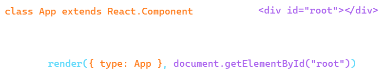
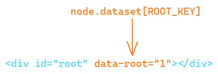
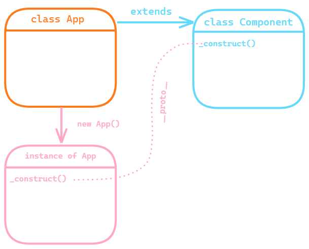
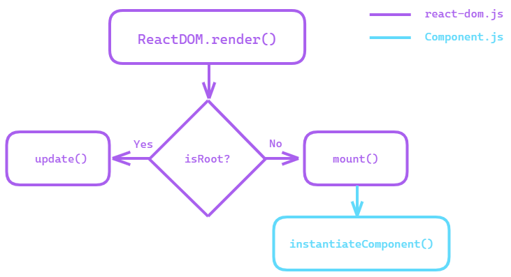

## Introduction

These series of articles are based on the <a href="https://twitter.com/zpao" target="_blank" rel="noopener">Paul O Shannessy</a> - <a href="https://www.youtube.com/watch?v=_MAD4Oly9yg" target="_blank" rel="noopener">Building React From Scratch</a> talk that he gave in 2016. 


He also uploaded source code to the <a href="https://github.com/zpao/building-react-from-scratch" target="_blank" rel="noopener">GitHub repo</a>.

Unfortunately, the talk was only 30 minutes long and to fully understand each part of this simplified implementation of React.js I spent days reading the source code and the comments. Even though the comments and the talk were super helpful, some parts of the code were like rocket science to me, especially recursive labyrinths of madness, until I was enlightened.

And now I decided to create a series of articles based on my notes and 'aha' moments.

I also recently found out that React.js team added their <a href="https://reactjs.org/docs/implementation-notes.html" target="_blank" rel="noopener">annotations</a> to <a href="https://www.youtube.com/watch?v=_MAD4Oly9yg" target="_blank" rel="noopener">Building React From Scratch</a> talk. And this document is pretty good (I hope it was available when I first started deep dive in it) but I still decided to create my own, more detailed version, maybe someone will find it easier to understand.

Main points to consider before starting to read these articles:
1. This is simplified React.js implementation, meaning that some parts of React.js are not included, such as refs, function components, keys, rendering arrays e.t.c;
2. This is the implementation of pre-fiber React.js. That is 15.x.x version;
3. For simplicity sake, I'm going to change some confusing for me parts of the original implementation and I'm not going to use package dependencies at all. That means, for example, instead of using babel plugin to transform `jsx` I will <a href="https://reactjs.org/docs/react-without-jsx.html" target="_blank" rel="noopener">describe elements using JavaScript objects</a>;
4. These articles are written in a very simple way so even beginners in JavaScript and React.js should understand what is going on;
5. At the end of each article, I will put a link to Codesandbox example and flowchart of what we've covered.
6. The source code will be available in <a href="https://github.com/RinatRezyapov/build-own-reactjs" target="_blank" rel="noopener">this repo</a> (by commit for each article);

Someone might ask a question "Why to spend time trying to understand the mechanics of the older version of React.js?"

Because I think you need to know "how it started" to understand "how it's going".
 
Let's go!

## How it starts

Let's start with refreshing our memory about how elements are described in React.js without using `jsx`.
```jsx
  // Describing component
  <App /> -> { type: App }
   // Describing component with props
  <App title="React.js" /> -> { type: App, props: { title: "React.js" } }

  // Describing element
  <div></div> -> { type: "div" }
```

>Notice the difference: for class component we use class component itself in the `type` field, for a DOM element we use string representation of this element. For now, that's all that we need to know.

I also want to clarify that by saying `element` I mean two things:
1. Object with the `type` field pointing to a class component (App) or DOM element ('div');
2. Simple JavaScript string (remember we can render strings?);

As you may know, typical React.js application starts by calling `ReactDOM.render` function where we pass an `element` as the first argument and a `node` which we use as a mounting point as the second argument. 

>To simplify things I want to add one restriction: we pass only class component element as the first argument to ReactDOM.render.

```jsx
ReactDOM.render({ type: App }, document.getElementById("root"))
```

Let's look at how we would implement this `render` function.

```js
function render(element, node) {
  if (isRoot(node)) {
    update(element, node);
  } else {
    mount(element, node);
  }
} 
``` 



As you can see, `render` function checks by using `isRoot` function whether we already mounted `App` class component to the node with the `root` id or not. If the class component is already mounted we perform the `update`, if not `mount`.

```js
  const ROOT_KEY = "root";

  function isRoot(node) {
    return node.dataset[ROOT_KEY];
  }
```

`isRoot` checks if our node has an <a href="https://developer.mozilla.org/en-US/docs/Learn/HTML/Howto/Use_data_attributes" target="_blank" rel="noopener">HTML5 dataset attribute</a> with the name `data-root`. We set this attribute in the `mount` function, which we will discuss later.



##Mount

Since initially we didn't mount anything to the node and didn't set `data-root` attribute we skip `update` and call `mount` function.

```js
  function mount(element, node) {
    node.dataset[ROOT_KEY] = rootID;
    const component = instantiateComponent(element);
    ... 
  }
```
In the `mount`, we set `data-root` attribute of the `node` to signalise that we are performing mounting.

Then, we instantiate the class component. Let's discuss what it means.

`instantiateComponent` will be used in several places and several conditions will be added to the body of the function in the future but for now, we just assume that `element` argument will be an object with the type field pointing to a class component.

```js
  function instantiateComponent(element) {
    const wrapperInstance = new element.type(element.props);
    wrapperInstance._construct(element);

    return wrapperInstance;
  }
```

Since `element.type` points to a class component we can use it to create an instance of this class component.

> From React.js docs: Class components have instances, but you never need to create a component instance directly—React takes care of this.

Well, in this case, we are building our own React.js so we have to take care of this :) Calling `new element.type(element.props)` in the following code snippet is the same as calling class constructor `new App(element.props)`.

```js
  const element = { type: App, props: { title: "React.js" }}
  new element.type(element.props) ---> new App({ title: "React.js" })
```

After an instance of the class component is created `instantiateComponent` function calls this strange `_construct` method of the newly created instance. But what the heck is `_construct`? Let's answer this question by trying to fire up what we already implemented. Spoiler alert: **It will break**. 

##First render

We will create `App` class component and use a div element with `root` id in our HTML file as a mounting point just as we do it in a real React.js application. But watch carefully, doesn't something look suspicious to you?

```jsx
class App {}

render({ type: App }, document.getElementById("root"));
```

<a href="https://codesandbox.io/s/boring-fog-eexvl?file=/src/index.js" target="_blank" rel="noopener">Codesandbox example</a>

That's right! Our `App` class must extend `React.Component` class to become a legitimate React.js class component. And `_construct` method of the instance of `App` class that we created is actually the method of `React.Component` class that `App` inherits when we create it as:

```jsx
  class App extends React.Component {

  }
```

>Let's call our implementation of `React.Component` just `Component` from now.



If you are not sure how classes and prototype chain work in JavaScript I recommend watching <a href="https://www.youtube.com/watch?a&v=PMfcsYzj-9M" target="_blank" rel="noopener">this video about it</a>.

This is a flowchart of what we've covered so far:



That's it for now. In the next episode of the *Build your own React.js series* we will implement `Component` class.

Links:
1. <a href="https://github.com/RinatRezyapov/build-own-reactjs" target="_blank" rel="noopener">Github repo with the source code from this article</a>
2. <a href="https://codesandbox.io/s/boring-fog-eexvl?file=/src/index.js" target="_blank" rel="noopener">Codesandbox with the code from this article</a>
3. <a href="https://www.youtube.com/watch?v=_MAD4Oly9yg" target="_blank" rel="noopener">Building React From Scratch talk</a>
4. <a href="https://reactjs.org/docs/implementation-notes.html" target="_blank" rel="noopener">React.js docs regarding Building React From Scratch talk</a>
5. <a href="https://developer.mozilla.org/en-US/docs/Learn/HTML/Howto/Use_data_attributes" target="_blank" rel="noopener">HTML5 dataset attribute</a>
6. <a href="https://reactjs.org/docs/react-without-jsx.html" target="_blank" rel="noopener">Describing elements using JavaScript objects</a>
7. <a href="https://www.youtube.com/watch?a&v=PMfcsYzj-9M" target="_blank" rel="noopener">The Definitive Guide to Object-Oriented JavaScript</a>